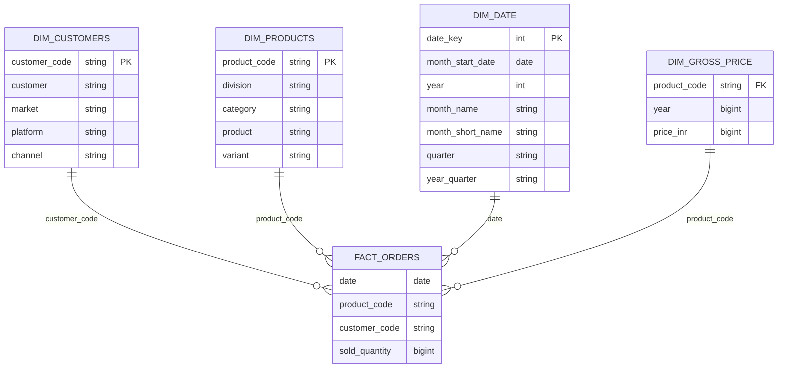

---
# databricks-fmcg-medallion-architecture-delta-lake
Designed and implemented an enterprise-grade FMCG Lakehouse pipeline on Databricks using Medallion Architecture and Delta Lake. The solution integrates child and parent company datasets, supports full and incremental processing, and implements SCD Type 2 for historical accuracy.

---
## Problem statement

Design a unified Lakehouse data platform in the FMCG domain to ingest and process historical and incremental data from a child company, align it with an existing parent company data model, and consolidate both into a single analytics-ready schema while ensuring data consistency, referential integrity, and full historical tracking (SCD Type 2).

---
## Architecture
```text
Raw CSV Data
s3 / Volumes
   ↓
Bronze Layer (Raw Delta Tables)
   ↓
Silver Layer (Cleaned & Conformed Data)
   ↓
Gold Layer (Business-Ready Dimensions & Facts)
```

---
## Project Structure

```text
databricks-fmcg-medallion-architecture-delta-lake/
│
├── 1_fmcg_dimension_data_processing/
│   ├── 1_customers_data_processing.ipynb
│   ├── 2_products_data_processing.ipynb
│   └── 3_pricing_data_processing.ipynb
│
├── 2_fmcg_fact_data_processing/
│   ├── 1_full_load_fact.ipynb
│   └── 2_incremental_load_fact.ipynb
│
├── child_company_raw_data/
│   ├── orders/
│   │   ├── landing/
│   │   │   └── orders.csv
│   │   └── processed/   # Files moved here after successful processing
│   │
│   ├── gross_price/
│   │   └── gross_price.csv
│   │
│   ├── customers/
│   │   └── customers.csv
│   │
│   └── products/
│       └── products.csv
│
├── parent_gold_layer_data/
│   ├── full_load
│   ├── incremental_load
│
├── setup/
│   ├── dim_date_table_creation.ipynb
│   ├── fmcg_catalog_schema.sql
│   └── schema_import.ipynb
│
└── README.md
```

---
## Medallion Architecture

#### Bronze Layer
- Ingests raw FMCG child company CSV data directly from `S3` / `Databricks Volumes` using Databricks Auto Loader `(cloudFiles)`
- Uses Structured Streaming with checkpointing to maintain state and guarantee exactly-once processing `trigger(availableNow=True)`
- Stores streaming metadata in `_checkpoint` directory for fault tolerance and restart safety.
- Enables automatic schema inference and schema evolution, with schema history maintained in `_schemas` location
- Supports seamless handling of new columns in incoming source files without breaking the pipeline
- Preserves original schema and records for traceability
- Data is stored as Delta tables to leverage ACID transactions, schema enforcement, and time travel
- Implements file-level ingestion control by moving successfully processed files from `landing` to `processed`, preventing duplicate ingestion.

#### Silver Layer
- Applies schema validation, null handling, and data standardization across child-company datasets.
- Aligns child company attributes to the parent company canonical data model.
- Implements deduplication and referential integrity checks between dimension and fact datasets.
- Prepares conformed dimensions and validated fact datasets for dimensional modeling.

#### Gold Layer
- Implements a dimensional model (Star Schema) integrating child and parent company datasets.
- Uses Delta Lake MERGE operations with `whenMatchedUpdateAll()` and `whenNotMatchedInsertAll()`
- Maintains referential integrity between fact and dimension tables.
- Optimized for BI queries, reporting, and downstream analytics
---

## Setup

#### 1. Create Catalog & Schemas

  Place below files under `setup/`
  
  - fmcg_catalog_schema.sql → to create catalog and schema for medallion architecture
  - dim_date_table_creation.ipynb → create date dimension table for gold layer in given data date range.
  - schema_import.ipynb → Bronze,silver,gold layer schema variables


#### 2. Upload Raw Data

  Place CSV files of child company data under `child_company_raw_data/`
  
  - Make sure `parent_gold_layer_data → full_load` already present in gold layer by directly importing csv data in tables.
  
  - `processed` folder is made to move already processed data from `landing` folder to make sure no re upload data


#### 3. Full load:

  ` 1_customers_data_processing.ipynb → 2_products_data_processing.ipynb → 3_pricing_data_processing.ipynb → 1_full_load_fact.ipynb `
  
  - Need to full load the child company historical data first till gold layer. Then Merge with Parent company by managing schema.

#### 4. Incremental load:

  ` 1_customers_data_processing.ipynb → 2_products_data_processing.ipynb → 3_pricing_data_processing.ipynb → 2_incremental_load_fact.ipynb `
  
  - After full load for daily incremental fact table data from `orders → landing` will be load andget merge with gold layer tables.
   
  - Dimension data can be full load daily becuase of count is less. at the end only updated data will be go in gold table because of merge logic.
	

#### 5. Orchestration
  - follow incremental load .ipynb files flow and create workflow for daily run.
  
---

## Gold layer Star schema ER-Diagram



---
## Tech Stack
```text
Databricks

PySpark

Delta Lake

Unity Catalog

Medallion Architecture

Auto Loader (cloudfiles) + _checkpoint + _schemas

SQL

Orchestration
```

---

## Key Highlights

- End-to-end FMCG data engineering project using **Databricks Medallion Architecture (Bronze, Silver, Gold)**
- Handles both **full historical loads** and **daily incremental data processing**
- Implements **Delta Lake MERGE** operations using `whenMatchedUpdateAll()` and `whenNotMatchedInsertAll()`
- Supports **Slowly Changing Dimension (SCD Type 2)** for maintaining complete historical accuracy
- Ensures **idempotent ingestion** by managing landing and processed folders
- Builds **analytics-ready Gold layer tables** optimized for BI reporting and dashboards
- Designed with **production-grade orchestration** using Databricks Workflows
- Modular and extensible design to onboard additional FMCG business units or data sources.
---

### Author

LinkedIn: http://www.linkedin.com/in/SwapnilTaware

GitHub: https://github.com/itsSwapnil

Email: tawareswapnil23@gmail.com

---
