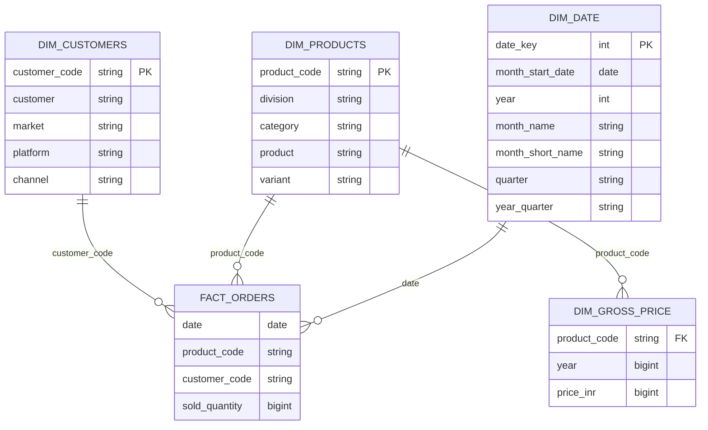

# databricks-fmcg-medallion-architecture-delta-lake
End-to-end FMCG data engineering project on Databricks using Medallion Architecture and Delta Lake. Ingests CSV data from Volumes/S3, processes Bronze–Silver–Gold layers with PySpark, supports incremental loads, Delta MERGE operations, and SCD Type 2 to deliver secure, analytics-ready datasets for business reporting.

---
## Problem statement

Design a unified Lakehouse ETL pipeline in the FMCG domain to process historical and incremental data for a child company, align it with an existing parent company pipeline, and consolidate both into a single analytics-ready platform while ensuring data consistency and historical accuracy.


## Architecture
```text
Raw CSV Data
s3 / Volumes
   ↓
Bronze Layer (Raw Delta Tables)
   ↓
Silver Layer (Cleaned & Conformed Data)
   ↓
Gold Layer (Business-Ready Dimensions & Facts)
```

## Project Structure

```text
databricks-fmcg-medallion-architecture-delta-lake/
│
├── 1_fmcg_dimension_data_processing/
│   ├── 1_customers_data_processing.py
│   ├── 2_products_data_processing.py
│   └── 3_pricing_data_processing.py
│
├── 2_fmcg_fact_data_processing/
│   ├── 1_full_load_fact.py
│   └── 2_incremental_load_fact.py
│
├── child_company_raw_data/
│   ├── orders/
│   │   ├── landing/
│   │   │   └── orders.csv
│   │   └── processed/   # Files moved here after successful processing
│   │
│   ├── gross_price/
│   │   └── gross_price.csv
│   │
│   ├── customers/
│   │   └── customers.csv
│   │
│   └── products/
│       └── products.csv
│
├── parent_gold_layer_data/
│   ├── full_load
│   ├── incremental_load
│
├── setup/
│   ├── dim_date_table_creation.py
│   ├── fmcg_catalog_schema.sql
│   └── schema_import.py
│
└── README.md
```

---
## Medallion Architecture

#### Bronze Layer
- Ingests raw FMCG child company CSV data directly from `S3` / `Databricks Volumes` without any transformation
- Preserves original schema and records for traceability
- Data is stored as Delta tables to leverage ACID transactions, schema enforcement, and time travel
- After successful ingestion, source files are moved to a `processed` folder to prevent duplicate data loads into the Bronze layer

#### Silver Layer
- Applies data quality rules and standardization
- Handles missing values, null handling, deduplication, and data type normalization
- Standardizes customer attributes and column names to align with the parent company data model
- Produces clean, conformed dimension and fact datasets for downstream consumptions

#### Gold Layer
- Generates curated, analytics-ready tables and implements a star schema–based design
- Uses Delta Lake MERGE operations with `whenMatchedUpdateAll()` and `whenNotMatchedInsertAll()`
- Optimized for BI queries, reporting, and downstream analytics
---


## Setup

#### 1. Create Catalog & Schemas

  Place below files under `setup/`
  
  - fmcg_catalog_schema.sql → to create catalog and schema for medallion architecture
  - dim_date_table_creation.py → create date dimension table for gold layer in given data date range.
  - schema_import.py → Bronze,silver,gold layer schema variables


#### 2. Upload Raw Data

  Place CSV files of child company data under `child_company_raw_data/`
  
  - Make sure `parent_gold_layer_data → full_load` already present in gold layer by directly importing csv data in tables.
  
  - `processed` folder is made to move already processed data from `landing` folder to make sure no re upload data


#### 3. Full load:

  ` 1_customers_data_processing.py → 2_products_data_processing.py → 3_pricing_data_processing.py → 1_full_load_fact.py `
  
  - Need to full load the child company historical data first till gold layer. Then Merge with Parent company by managing schema.

#### 4. Incremental load:

  ` 1_customers_data_processing.py → 2_products_data_processing.py → 3_pricing_data_processing.py → 2_incremental_load_fact.py `
  
  - After full load for daily incremental fact table data from `orders → landing` will be load andget merge with gold layer tables.
   
  - Dimension data can be full load daily becuase of count is less. at the end only updated data will be go in gold table because of merge logic.
	

#### 5. Orchestration
  - follow incremental load .py files flow and create workflow for daily run.
  
---


## Gold layer Star schema ER-Diagram


---
## Tech Stack
```text
Databricks

PySpark

Delta Lake

Unity Catalog

Medallion Architecture

SQL

Orchestration
```

---

## Key Highlights

- End-to-end FMCG data engineering project using **Databricks Medallion Architecture (Bronze, Silver, Gold)**
- Handles both **full historical loads** and **daily incremental data processing**
- Implements **Delta Lake MERGE** operations using `whenMatchedUpdateAll()` and `whenNotMatchedInsertAll()`
- Supports **Slowly Changing Dimension (SCD Type 2)** for maintaining complete historical accuracy
- Ensures **idempotent ingestion** by managing landing and processed folders
- Builds **analytics-ready Gold layer tables** optimized for BI reporting and dashboards
- Designed with **production-grade orchestration** using Databricks Workflows
- Scalable, modular, and easy to extend for new FMCG data sources
---


### Author

LinkedIn: http://www.linkedin.com/in/SwapnilTaware

GitHub: https://github.com/itsSwapnil

Email: tawareswapnil23@gmail.com

---
